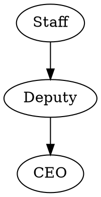

# 🧠 Power Is Structure

> A graph-based engine to assess organizational power structures for hidden risks, miscommunication, and potential corruption.  
> Upload a DOT graph, get a transparency index and structural diagnostics.

---

## 📘 Summary

**Power Is Structure** is an open-source engine that represents organizations as **graphs of authority and communication**.  
It analyzes them to detect **corruption-prone patterns**, **information flow asymmetry**, and **control bottlenecks**.

The core idea is simple:  
> **Corruption is not random — it emerges from structure.**

By modeling hierarchies as graphs and identifying specific anti-patterns, we calculate a **Power Transparency Index**,  
a quantitative estimate of how structurally robust (or fragile) an organization is.

---

## 🎯 Use Cases

- 🏛️ Government ministries and civil institutions
- 🏢 Corporations and enterprise departments
- 🧩 NGOs and distributed organizations
- 🧠 Research in governance, transparency, and ethics
- 🧪 Experimental simulations and academic analysis

**Example Outcomes:**
- 🔍 Discover hidden authority loops before audits
- 📉 Quantify structural risks to guide reorganization
- 🛡 Support transparency efforts with measurable metrics

---

## ⚙️ How It Works

### 1. Input  
Submit a graph in [DOT format](https://graphviz.org/doc/info/lang.html) describing authority and reporting links.

### 2. Analysis  
The engine parses your graph and detects structural issues:

- ⚠️ **Opacity Triangles** – filtered one-way chains of control
- 🚨 **Control Monopolies** – unsupervised central managers
- 🕸️ **One-way Subgraphs** – no feedback paths upward
- 📉 **Cascade Weakness** – disconnected top management
- 🔀 **Responsibility Conflict** – multiple managers with no clear hierarchy

### 3. Output  
You receive a structured JSON report:

- ✅ **Transparency Index** (0–100)
- 🧠 **Information Summary** – key metrics, influencer roles, isolated nodes
- 🛑 **Detected Issues** – matched patterns and risk assessments

---

## 🛠 Example

### Request (DOT)



### Response (JSON)

```json
{
  "transparency_index": 76.4,
  "information": {
    "total_nodes": 17,
    "total_edges": 28,
    "hierarchy_levels": 4,
    "top_influencers": [
      { "id": "ID001", "name": "Deputy Director", "incoming_edges": 8 },
      { "id": "ID002", "name": "HR Head", "incoming_edges": 6 }
    ],
    "isolated_nodes": [
      { "id": "ID017", "name": "Consultant" }
    ],
    "potential_risk_nodes": [
      { "id": "ID005", "name": "Middle Manager", "reason": "Single upward path, no cross-validation" }
    ]
  },
  "issues": [
    {
      "type": "Opacity Pattern",
      "description": "Node ID005 has exclusive access to superiors and subordinates",
      "nodes_involved": ["ID004", "ID005", "ID006"]
    },
    {
      "type": "Responsibility Imbalance",
      "description": "Node ID001 has 8 subordinates, Node ID007 has none",
      "nodes_involved": ["ID001", "ID007"]
    },
    {
      "type": "Disconnected Role",
      "description": "Node ID017 is not connected to the graph",
      "nodes_involved": ["ID017"]
    }
  ]
}
```

---

## 🧠 Why It Matters

Organizational abuse doesn't stem from individuals — it stems from unchecked structures.  
By making those structures **visible and measurable**, we bring **accountability to design** itself.

Think of it as **linting for hierarchies.**

---

## 🔗 Resources

- 📜 [Manifesto of Structural Transparency](./MANIFESTO.md)
- 🧩 [Structural Pattern Catalog](./patterns.md)
- 📄 [API Documentation (soon)](./docs/api.md)
- 🧪 [Try Online (coming soon)](https://powerisstructure.com)

---

## 🔓 License

This project is released under the **Mozilla Public License 2.0 (MPL-2.0)**.  
You’re free to use, extend, and integrate the code.  
Changes to the core logic must be published under the same license.

---

## 👤 Author

Created by **Leonid Baranov**,  
software architect and organizational structure researcher.

Inspired by real-world patterns encountered in both post-Soviet and Western governance models.

---

## 🚀 Roadmap

- [x] Core index calculation engine
- [x] Anti-pattern detection
- [ ] Graph visualization patterns
- [ ] Public REST API
- [ ] Graph playground (web)
- [ ] HR/audit system integrations
- [ ] Plugin & pattern registry

---

## 🧑‍💻 Contributing

Contributions are welcome!

- 📦 Submit new graph patterns
- 🧠 Improve detection heuristics
- 📊 Build visual tools
- ✍️ Share anonymized real-world examples

See [CONTRIBUTING.md](./CONTRIBUTING.md) for details.
